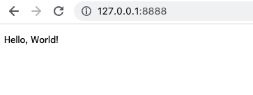

# フレームワークGinを使って簡単なWebアプリを作る
## Ginとは
Go言語の最も人気なWebフレームワーク<br>
Gin公式は[こちら](https://gin-gonic.com/ja/)
<br>
<br>

## モジュール管理にgo modを使う
とりあえず書かれている通り入れます。
```
# プロジェクトのフォルダを作成とそのフォルダに移動
$ mkdir hello_gin && cd hello_gin 
# go modを初期化 
$ go mod init hello_gin
```
go modについては↓ここで軽く知識を仕入れました。<br>
[go mod 完全に理解した](https://zenn.dev/optimisuke/articles/105feac3f8e726830f8c)
<br>

## Ginのインストール
今回はv1.7.4をインストール
```
$ go get github.com/gin-gonic/gin@v1.7.4
```
準備は完了。
<br>

## ひとまずHello world
`main.go`を作成して以下を記述
```
package main

import (
	"github.com/gin-gonic/gin"
	"log"
)

func main() {
  // ルーターを準備 --- (*1)
	router := gin.Default()
  // URIとハンドラを指定 --- (*2)
	router.GET("/", func(ctx *gin.Context) {
		ctx.String(200, "Hello, World!")
	})
  // サーバーを起動 --- (*3)
	err := router.Run("127.0.0.1:8888")
	if err != nil {
		log.Fatal("サーバー起動失敗", err)
	}
}
```
まだ詳しくわかってませんが、とりあえず`go run .`で起動
```
go run .
```
*3のサーバー起動で決めたポートをブラウザのアドレスバーに入力すると<br>
<br>
出ましたね。
<br>
<br>
## 流れ
まずGinのWebアプリでは、どのアドレスにアクセスがあった時に何を返すかを指定することで成り立つ。<br>
`*1`がアドレスと機能を管理するrouter<br>
`*2`ではサーバーのルート（"/"）にアクセスした時にHello,World!と表示する要指定している<br>
`*3`ではサーバーを起動しています。<br>
今回だと127.0.0.1はPC自身のアドレスで、8888がポート番号<br>
